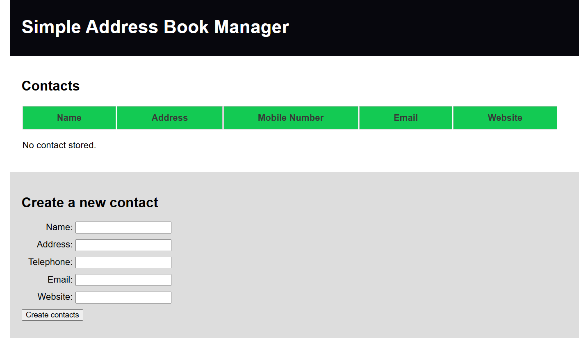

# Address Book Manager

Welcome to the Address Book Manager, a simple and easy-to-use website for managing your address book.

## Features:
- Create and delete address books
- Store data temporarily
- Add contact details:
  - Name
  - Address
  - Mobile Number
  - Email
  - Website

## Usage:
1. Clone this repository.
2. Open `index.html` in your web browser.
3. Start managing your address book!

## About Me  

Hi, I’m **Ankush Raj**, an aspiring software developer. I’m passionate about coding and enjoy sharing my learning journey to help others grow.  

🌟 Connect with me:  
- **Google Search:** [Ankush Raj Mahe Yam](https://www.google.com/search?q=ankush+raj+mahe+yam)  
- **LinkedIn:** [Ankush Raj Mahe Yam](https://linkedin.com/in/ankushrajmaheyam)  
- **GitHub:** [Ankush Raj Mahe Yam](https://github.com/AnkushRajMaheYam)  
- **Instagram:** [@AnkushRajaMaheYam](https://instagram.com/AnkushRajaMaheYam)  
- **Facebook:** [Ankush Raj Mahe Yam](https://facebook.com/AnkushRajMaheYam)  

---

## License
This project is licensed under the MIT License - see the [LICENSE.md](https://github.com/AnkushRajMaheYam/Address-Book-Manager/blob/main/LICENSE.md) file for details.

## Author
This website was created by Ankush Raj Mahe Yam (ARMY). All rights reserved.

[Ankush Raj Mahe Yam (ARMY)](https://github.com/AnkushRajMaheYam)
